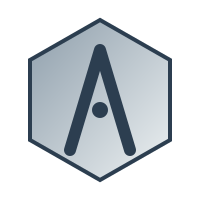
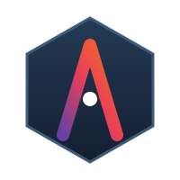

# Hi there, I'm Fkm_X3 👋

## 🚀 About Me

I'm a young developer passionate about making open source projects in mainly Rust and C. If I think I can make a project fundementally better, i clear it out and rebuild from scratch.

## 💻 Featured Projects
### Alloy-OS
a os built from scratch in c/c++ and rust

[Alloy OS](https://github.com/fkm-X3/Alloy-OS)

 

## 🔥 GitHub streak

## Metrics

## What am I cooking up?

- 🔭 Working on: Idot-lang and Alloy-OS
- 🌱 Learning: Low level systems programing
