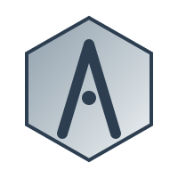

# Hi there, I'm Fkm_X3 👋

You will learn infinitely more by giving something a good try then sitting around and learning about the "Why did this project die".

## 💻 Featured Projects
### Alloy-OS
A OS from scratch built from scratch in Rust and C/C++

[Alloy OS](https://github.com/fkm-X3/Alloy-OS)

 

## 🔥 GitHub streak

## Metrics

## What am I cooking up?

- 🔭 Working on: Alloy-OS and Tungsten
- 🌱 Learning: Low level systems programing
